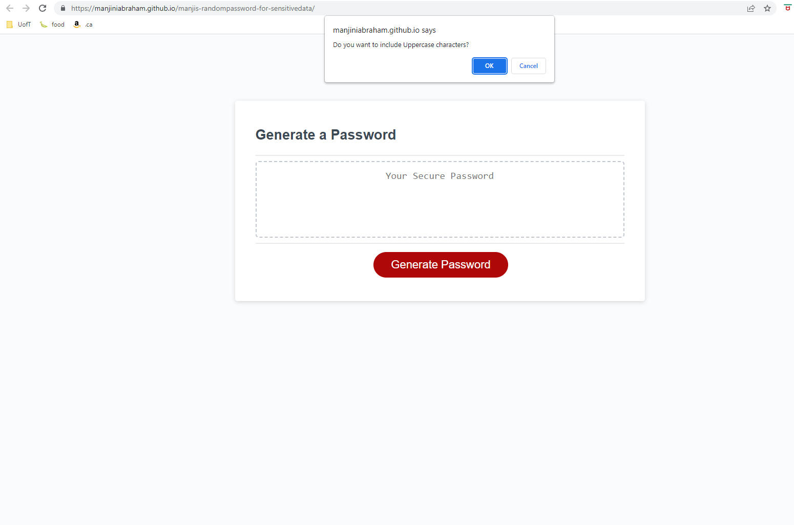
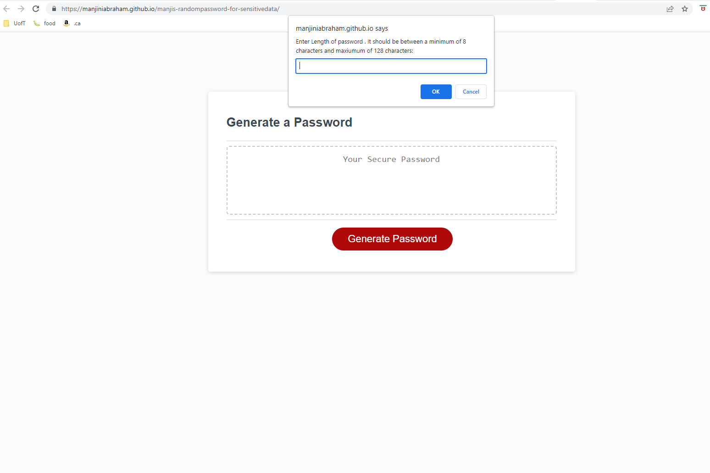
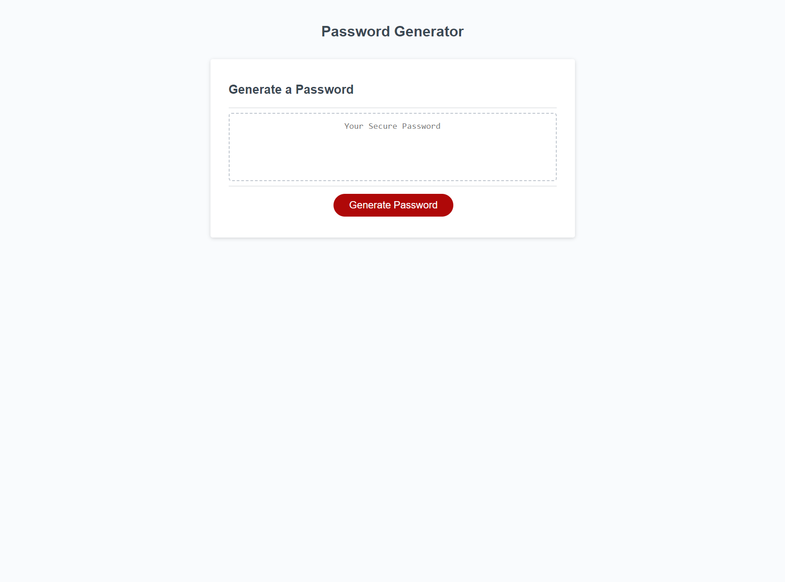

# manjis-randompassword-for-sensitivedata

## Description
This project is about modifying the  starter code to create an application that enables employees to generate random passwords based on criteria that they’ve selected.

## Installation
NA

## Usage

Application URL: https://manjiniabraham.github.io/manjis-randompassword-for-sensitivedata/

## Credits

https://developer.mozilla.org/en-US/docs/Web/JavaScript/

https://www.w3schools.com/

https://www.youtube.com/@programmingwithmosh/search?query=javascript

## Features

* The Random Password Generator has the following features:
	* On clicking the button to generate a password, user is presented with a series of prompts for password criteria like
	a) to enter the length of the password.
	b) to confirm whether or not to include lowercase, uppercase, numeric, and/or special characters

	* User is prompted with an alert to choose atleast one type of characters 
	
	* All inputs are validated and a password is generated and displayed based on the selections made by the user.

